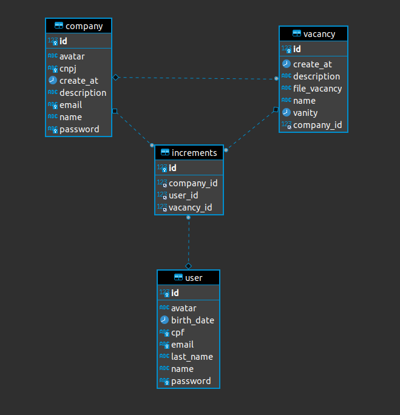

# Controle-empregos

Sistema de controle de empregos tem como intuito gerenciar as vagas de emprego.  
As empresas iram anunciar as vagas e os usuários se candidatará as vagas anunciadas caso o mesmo queira.

As vagas deverão ter o nome da vaga anunciada, uma descrição da vaga e um arquivo pdf ou imagen caso necessário.
Tambem deverá ter se a vaga ainda está ativa.

<h3>O esquema do banco ficou da seguinte forma</h3>
 

